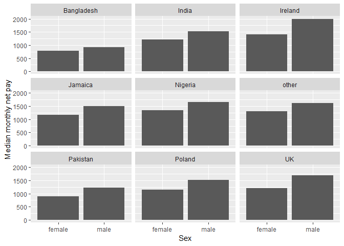

Statistical assignment 3
================
\[james hawkey\] \[add your candidate number here - mandatory\]
\[add date here\]

## Read data

In this assignment you will need to reproduce 5 ggplot graphs. I supply
graphs as images; you need to write the ggplot2 code to reproduce them
and knit and submit a Markdown document with the reproduced graphs (as
well as your .Rmd file).

First we will need to open and recode the data. I supply the code for
this; you only need to change the file paths.

``` r
library(rlang)
library(tidyverse)

Data8 <- read_tsv("C:/Users/Jenny/Documents/defer/h_indresp.tab")


Data8 <- Data8 %>%
  select(pidp, h_age_dv, h_payn_dv, h_gor_dv)

Stable <- read_tsv("C:/Users/Jenny/Documents/defer/xwavedat.tab")


Stable <- Stable %>%
  select(pidp, sex_dv, ukborn, plbornc)

Data <- Data8 %>% left_join(Stable, "pidp")

rm(Data8, Stable)
Data <- Data %>%
  mutate(sex_dv = ifelse(sex_dv == 1, "male",
                         ifelse(sex_dv == 2, "female", NA))) %>%
  mutate(h_payn_dv = ifelse(h_payn_dv < 0, NA, h_payn_dv)) %>%
  mutate(h_gor_dv = recode(h_gor_dv,
                           `-9` = NA_character_,
                           `1` = "North East",
                           `2` = "North West",
                           `3` = "Yorkshire",
                           `4` = "East Midlands",
                           `5` = "West Midlands",
                           `6` = "East of England",
                           `7` = "London",
                           `8` = "South East",
                           `9` = "South West",
                           `10` = "Wales",
                           `11` = "Scotland",
                           `12` = "Northern Ireland")) %>%
  mutate(placeBorn = case_when(
    ukborn  == -9 ~ NA_character_,
    ukborn < 5 ~ "UK",
    plbornc == 5 ~ "Ireland",
    plbornc == 18 ~ "India",
    plbornc == 19 ~ "Pakistan",
    plbornc == 20 ~ "Bangladesh",
    plbornc == 10 ~ "Poland",
    plbornc == 27 ~ "Jamaica",
    plbornc == 24 ~ "Nigeria",
    TRUE ~ "other")
  )
```

Reproduce the following graphs as close as you can. For each graph,
write two sentences (not more\!) describing its main message.

1.  Univariate distribution (20
points).

<!-- end list -->

``` r
#the graph shows the distroubtion of the net monthly pay of the respondents. 
#the graph shows that the mode of the results is sligtly over the 1000 pounds mark with a steady decrease after.
#there is a slight increase just pasted the 5000 pound marker.

Data %>%
ggplot(aes(x=h_payn_dv)) +
  geom_freqpoly(binwidth = 275)+
  xlab("Net monthly pay") +
  ylab("Number of respondents")+
  scale_y_continuous(breaks = seq(1000,2000,1000))
```

    ## Warning: Removed 22638 rows containing non-finite values (stat_bin).

<!-- -->
2. Line chart (20
points).

``` r
#the graph shows that both males and females have and increase in monthley earnings from the ages of 20 to 45

# the male line shows that on a whole males have a higher monthley earings which also increase at a higher rate comparied to there female counterparts. this stead increase starts to reverse at the 45 age mark falling back to just over 1500 of monthly earings.

# the female line shows that while there is a simlair level of increase compared to the males up untill about the 25 age mark the increase after that becomes much less and progress much slower between the ages of 25 to 50 and then decrease as well.
DataSex <- Data[which(!is.na(Data$sex_dv)),]

plotSmooth<- DataSex%>%
  filter(h_age_dv<66) %>%
  ggplot(aes(x=h_age_dv, y=h_payn_dv, group=sex_dv, linetype=sex_dv)) + 
  geom_smooth(method = "loess", formula = y ~ x, color = "black") + 
  xlab("Age") + 
  ylab("Monthly earnings")
plotSmooth$labels$group <- "Sex"
plotSmooth$labels$linetype <- "Sex"
plotSmooth
```

    ## Warning: Removed 14403 rows containing non-finite values (stat_smooth).

<!-- -->

3.  Faceted bar chart (20
points)

<!-- end list -->

``` r
# these bar charts show the difference between the median monthly net pay between between males and female with in countrys in the data set. all of the charts show that males average high monthely incomes than females.
#there bar charts also highlight the differenct in median monthely net pay through out the defferent countrys 
#the different between male and females median monthely pay also differs between the countrys with banladesh haveing the closet level between the sexs while ireland and the uk have the largest 
Data_medianPay <- Data %>% 
  group_by(placeBorn, sex_dv) %>% 
  summarise(medianPay = median(h_payn_dv,na.rm=TRUE))
Data_medianPay <- Data_medianPay[!is.na(Data_medianPay$sex_dv),]
Data_medianPay <- Data_medianPay[!is.na(Data_medianPay$placeBorn),]

ggplot(Data_medianPay, aes( x = sex_dv, y = medianPay ) ) + 
      geom_bar( stat = "identity" ) + 
      facet_wrap( ~ placeBorn ) + 
      xlab("Sex") + 
      ylab("Median monthly net pay")
```

<!-- -->

4.  4.  Heat map (20
points).

<!-- end list -->

``` r
#this heat map shows the mean age of the different coutrys within the data set alnog with the different regions the darker the shade the youner the mean age nigeria as one of the youngest mean ages.
Data_meanAge <- Data %>% 
  group_by(h_gor_dv, placeBorn) %>% 
  summarise(meanAge = mean(h_age_dv))

Data_meanAge <- Data_meanAge[which(!is.na(Data_meanAge$h_gor_dv)),]
Data_meanAge <- Data_meanAge[which(!is.na(Data_meanAge$placeBorn)),]

Data_meanAge %>%
  ggplot(aes(h_gor_dv, placeBorn)) +
  geom_tile(aes(fill = meanAge)) +
  xlab("Region") + 
  ylab("City of birth") + 
  theme_bw() + 
  theme(panel.border = element_blank(), panel.grid.major = element_blank(),
        panel.grid.minor = element_blank(), axis.line = element_blank(),
        axis.text.x = element_text(angle = 90, hjust = 1)) + 
  labs(fill = "Mean age")
```

<!-- -->

5.  Population pyramid (20
points).

<!-- end list -->

``` r
# this population pyramid allows us to veiw the age disturbtion through out the population in shows a developed coutrys distrubtion. the under 25 age marker there are peaks of 300 n but after this there is a small decrease in the percentage falling to just over 200 in regards to the male population and 250 for the female. after this decrease there is a increase of porotion up untill the age of 50 where both male and female reach there peaks. after this the population protion inregards to ages begins to decrease along with age.

Data_nAge <- Data %>% 
  group_by(h_age_dv, sex_dv) %>% 
  summarise(nAge = n())
Data_nAge$nAge <- ifelse(Data_nAge$sex_dv == "male", -1*Data_nAge$nAge, Data_nAge$nAge)

ggplot(Data_nAge, aes(x = h_age_dv, y= nAge, fill = sex_dv)) + 
  geom_bar(data = subset(Data_nAge, sex_dv == "female"), stat = "identity") + 
  geom_bar(data = subset(Data_nAge, sex_dv == "male"), stat = "identity") + 
  scale_fill_manual("Sex", values = c("female" = "red", "male" = "blue")) + 
  xlab("Age") + 
  ylab("n") + 
  theme_bw() + 
  coord_flip() 
```

<!-- -->
